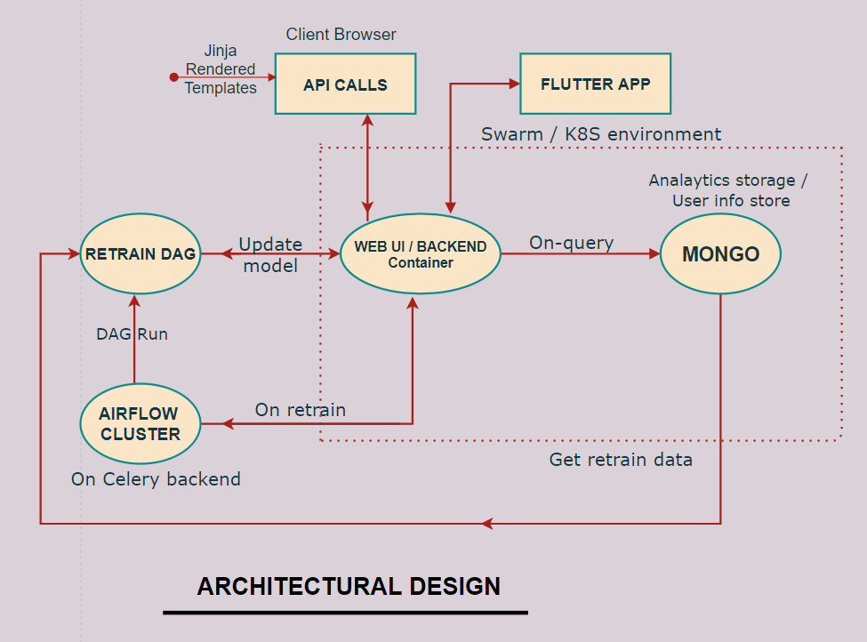
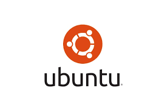

# Welcome to IPM!
Jarvis for developers...
## About
IPM is a intelligent **AI-based voice assistant** that provides voice-based access to all major project management platforms such as **Jira, Bitbucket, Confluence and Github**. 

Now also get your mails managed by the IPM and create notes and MOM for your meetings.  

So, IPM is your personal **Jarvis**, a tool from the future; for the future.

### Use Case
- The user can ask queries through voice-to-text conversion and will get appropriate text-to-voice response from IPM.
- IPM will assist the scrum master by taking notes of the important discussions and store them in its database for future reference. 
- Can be easily integrated with project management platforms like Jira, Confluence, Bitbucket, Github and Gmail.
- Creates MOM of scrum ceremonies easily.
- Create a Jira task/Github repository just by a voice command.
- Pulls out an e-mail by its sender or by its subject through a simple voice query.

### Architectural diagram

### Workflow
#### - Query Processing
 

#### - Keyword Extraction

#### - MoM Extraction

## Features
<!--modular object oriented designing approach that makes any part easily replacable-->

### - Github
> - Voice based commands to find details of various repositories of the user .
>- User can find commits, pull requests as well as issues of any repository.

   
   
### - Jira
>- Issues can be created, updated or deleted through voice commands.
>- Attachment actions like creating attachment as a comment or adding them.
   
 
### - Confluence
>- Voice based creation of pages.
>- Organises your attachment in folders.
>- Easily checks if a task is complete, assigned or due
   

### - Bitbucket
>This module intelligently answers user's query, regarding any repository on BitBucket.
Main query include-
>- Manage repositories like granting permission to an specific user or group,getting branching model,etc
>- Manage projects like creating a project, fetching project summary.

   
   
### - Minutes OF Meetings
>This module intelligently creates MOM during the scrum ceremony for the future reference 

## Installation 
### Requirements
>-  <a href="https://www.microsoft.com/en-in/windows/get-windows-10"> Windows 10 </a>
or
>- <a href="https://ubuntu.com/#download"> Ubuntu 18.04 </a>

#### Backend & Web UI Host Requirements
> <a href="https://www.djangoproject.com/">  Django- (sqlite) </a>

<!--Starting here about Django -->          
> Meet Django
Django is a high-level Python Web framework that encourages rapid development and clean, pragmatic design.
Built by experienced developers, it takes care of much of the hassle of Web development, so you can focus
on writing your app without needing to reinvent the wheel. It’s free and open source.  

 >- Ridiculously fast
 >-- Django was designed to help developers take applications from concept to completion as quickly as possible.      

 >- Reassuringly secure
 >-- Django takes security seriously and helps developers avoid many common security mistakes.

 >- Exceedingly scalable
 >-- Some of the busiest sites on the Web leverage Django’s ability to quickly and flexibly scale.

 <a href="https://www.djangoproject.com/start/overview/">Learn more about Django</a>

#### Supported Android versions
>Android 7 and above (Android apps are tested on Android 7)

## Resources
- https://github.com/PyGithub/PyGithub
- https://github.com/usablica/intro.js/
- https://github.com/dongjun-Lee/text-summarization-tensorflow

## License
Apache License 2.0
